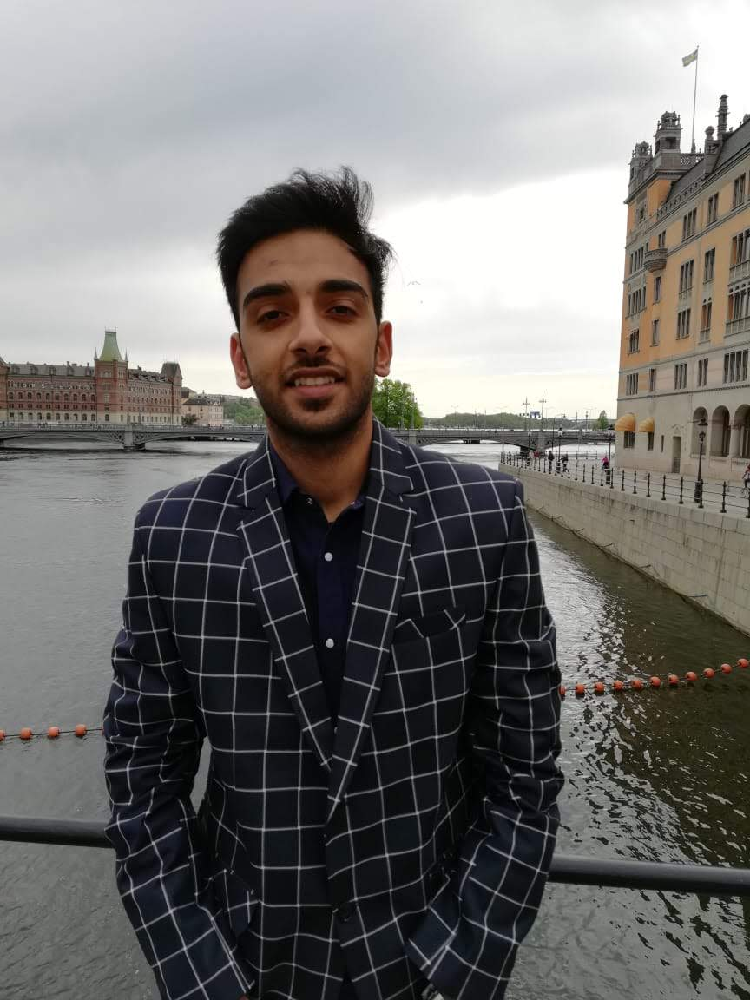

# Yashish Dua

#

### Blogs
[Medium](https://medium.com/@yashishdua)

### Sessions/Talks

##### 2019

- **AWS Lambda - Stepping into Serverless architecture [Hackr Bootcamp]** (25 May)
  - Venue: [91 Springboard](https://www.91springboard.com/)
  - Presentation: [Speakerdeck](https://speakerdeck.com/yashishdua/aws-lambda-stepping-into-serverless-architecture)
  - Event Listing: [Meetup](https://www.meetup.com/Hackr-Bootcamp/events/261011154/)
  - Video: [Facebook](https://www.facebook.com/hackr.io/videos/671758289904858/)

- **Understanding Synchronization in Golang  [Women Who Go New Delhi '19]** (12 January)
  - Venue: [Knoldus](https://www.knoldus.com/home.knol)
  - Presentation: [Speakerdeck](https://speakerdeck.com/yashishdua/synchronisation-in-go)
  - Event Listing: [Meetup](https://www.meetup.com/New-Delhi-Women-Who-Go/events/257843200/)
  
  
##### 2018

- **Designing Apps for Real World.  [GDG New Delhi - Android Day '18]** (22 December)
  - Venue: [Thoughtworks](https://www.thoughtworks.com/)
  - Presentation: [Speakerdeck](https://speakerdeck.com/yashishdua/designing-apps-for-real-world)
  - Event Listing: [GDG New Delhi Website](https://gdgnd.org/gdg-new-delhi/events/android-day)
  
- **Decoding Google I/O 18 Android App  [GDG New Delhi - DevFest '18]** (28 October)
  - Venue: Radisson Blu Plaza Delhi Airport
  - Presentation: [Speakerdeck](https://speakerdeck.com/yashishdua/o-18-android-app)
  - Event Listing: [GDG New Delhi Website](https://gdgnd.org/gdg-new-delhi/events/devfest-18)
  
- **Get set Go  [Facebook Developer Cirle - Delhi/NCR '18]** (2 April)
  - Venue: Springboard, Nodia
  - Presentation: [Speakerdeck](https://speakerdeck.com/yashishdua/get-set-go)
  - Video: [Facebook](https://www.facebook.com/saransh.kataria/videos/10216284219923827/)
